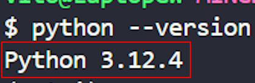
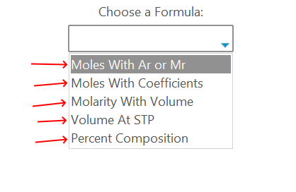
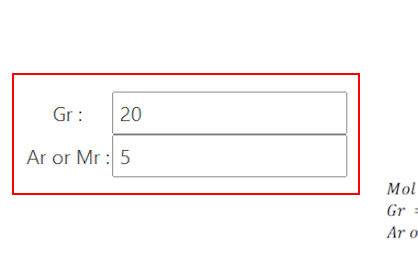
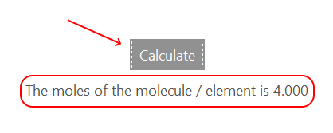

# 📄Final Project - Chemistry Formula Calculator 🧪

## 1️⃣Introduction
An App made using the programming language **Python**. This app also uses **Tkinter** and **Ttkbootstrap**. This app is used to calculate various chemistry formulas such as:

- Calculating **moles** using relative atomic / molecular mass,
- Calculating **moles** using the asked and given coefficients and moles,
- Calculating the **molarity** of a solution,
- Calculating the **volume** of gas at standard temperature and pressure, and
- Calculating the **percent of composition** of a molecule.

This app is made for the final project of my own coding class.

## ❓Purpose of app

This app is made to make it easier for students to learn chemistry formulas for various exams and quizzes.

## ⚙️How to run the app
1. Activate the virtual environment.
   1. First, type the following on the terminal to create the venv file:
      ```bash
      python -m venv <venv name>
      ```
   2. To activate the virtual environment, use this code:
      ```bash
      source <venv name>/scripts/activate
      ```

2. Make sure that python has already been installed.

   
3. Install the required modules by using this code:
   ```bash
   pip install -r requirements.txt
   ```
4. Open the project by typing:
   ```bash
   python chem.py
   ```
5. Select the formula that you wanted to use.

   
6. Fill in all the required fields.

   
7. Press the "Calculate" button, and the results will apprear below the button.

   

## ❗Program Capabilities
- Able to change the display whenever you choose another formula
- Able to catch errors live **ZeroDivisionError** and missing inputs

## 🔉Final Words
I hope that this app can benefit students and teachers in learning chemistry. Thanks for using this product. This product is made my **Vito Flabianos Foe** with the help of materials that is taught by **Mr. Sepri** and some materials that i got from ***Google***.